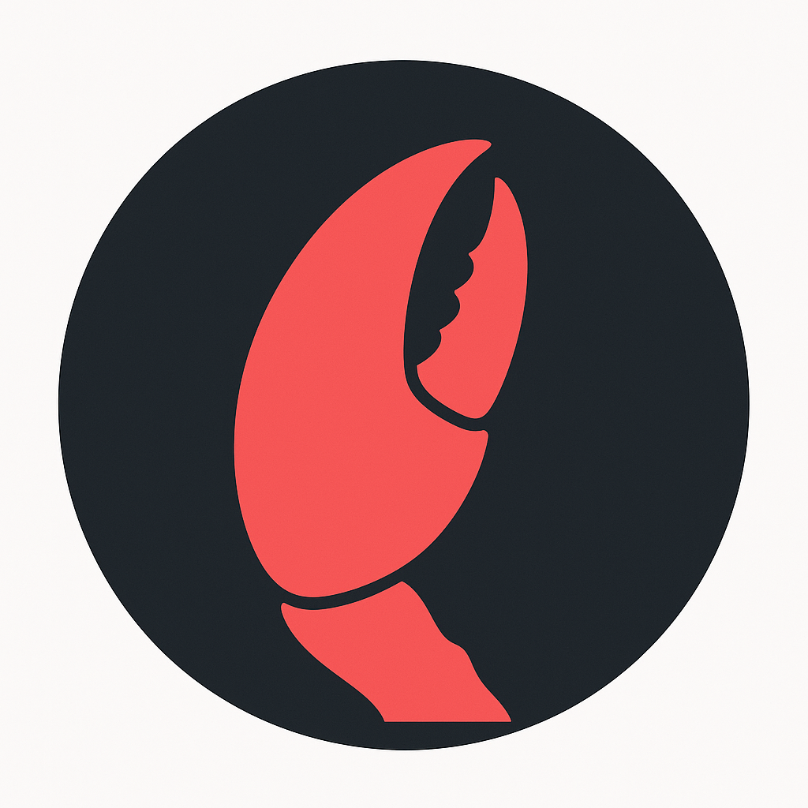

# 🦞 Pinchr

**The AI command center for OpenClaw.**

Pinchr is a native macOS desktop app that gives you a premium interface for your OpenClaw AI assistant. Think of it as the cockpit for your AI — chat, voice, automations, and every channel in one place.



## Features

- **💬 Streaming Chat** — Real-time conversation with your OpenClaw gateway
- **🎙️ Voice Mode** — Push-to-talk with Whisper transcription + TTS playback
- **🔒 Security Dashboard** — Activity log of every AI action, permission scopes, resource monitor, kill switch
- **📱 Omnichannel Timeline** — WhatsApp, Slack, email, iMessage unified in one view
- **⌘K Command Palette** — Fuzzy search across all actions
- **🗂️ Workspaces** — Role-based contexts (CEO, Developer, PM, etc.)
- **📋 Task Scheduling** — Cron jobs and automations from the UI
- **🔌 Connections Hub** — Manage integrations (Gmail, Calendar, GitHub, etc.)
- **💬 In-App Support** — Chat with support, persisted to cloud
- **📊 Telemetry** — Anonymous usage tracking with full opt-out
- **🔄 Auto-Updater** — Checks for new versions automatically
- **🖥️ System Tray** — Runs in background, native notifications

## Quick Start

### Prerequisites

- macOS 13+ (Apple Silicon or Intel)
- [OpenClaw](https://github.com/openclaw/openclaw) installed and running

### Install

Download the latest `.dmg` from [Releases](https://github.com/taw0002/pinchr-desktop/releases).

> **Note:** This build is unsigned. On first open, right-click → Open to bypass macOS Gatekeeper.

### Development

```bash
git clone https://github.com/taw0002/pinchr-desktop.git
cd pinchr-desktop
npm install
npm run dev
```

### Build

```bash
npm run dist        # Build .dmg + .zip
npm run dist:dmg    # Build .dmg only
```

## Architecture

```
src/
├── main/               # Electron main process
│   ├── index.ts        # App lifecycle, tray, windows
│   ├── gateway.ts      # OpenClaw gateway connection
│   ├── ipc.ts          # IPC handlers
│   ├── telemetry.ts    # Usage tracking
│   ├── updater.ts      # Auto-update checker
│   └── activity-log.ts # Security activity logger
├── preload/            # Context bridge
├── renderer/src/       # React UI
│   ├── pages/          # Chat, Dashboard, Security, Tasks, Settings, etc.
│   ├── components/     # Sidebar, shared components
│   ├── hooks/          # useGateway, useLicense
│   └── lib/            # Workspaces, utilities
└── shared/             # Shared types
```

## Tech Stack

- **Electron** 33 + **electron-vite**
- **React** 19 + **TypeScript**
- **Tailwind CSS** + custom design system
- **Framer Motion** for animations

## Pricing

| Tier | Price | Features |
|------|-------|----------|
| Free | $0 | Chat, ⌘K, tray, notifications |
| Pinchr | $20 one-time | Full app (7-day trial) |
| Pro | $12/mo | Voice, omnichannel, tasks, bundled AI API |
| Team | $29/mo/seat | Multi-agent, shared workspaces, audit logs |

## License

MIT — see [LICENSE](LICENSE).

---

Built with ❤️ by [Pinchr](https://pinchr.app) • Powered by [OpenClaw](https://github.com/openclaw/openclaw)
